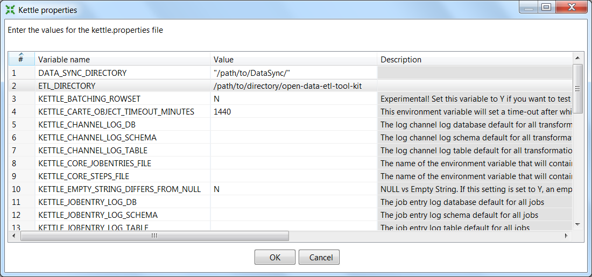
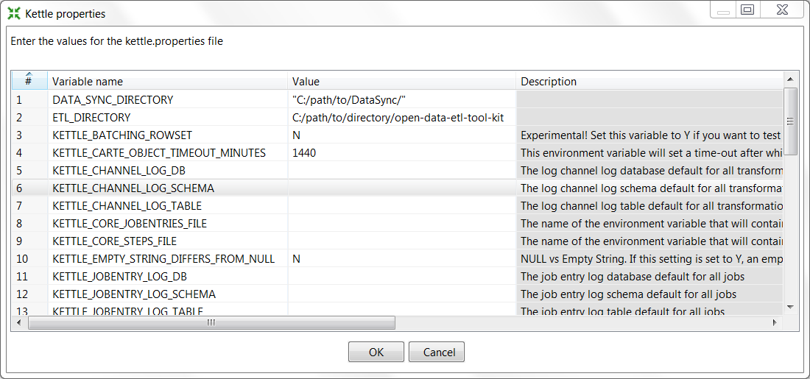

============================
Installation & Configuration
============================

This section outlines basic installation procedures for Kettle, the
open data ETL framework, and other necessary components. This section
also discusses some suggested configurations which will allow for
easier maintenance over time.

Installation consists of three parts

* Cloning or installing toolkit repository
* Installing Kettle (or Pentaho)
* Installing Socrata DataSync
* Configuring Kettle and DataSync installation

Installation on Mac OS X, Linux, or Unix
========================================

Installing ETL framework
------------------------

First, determine a location of the installation of the toolkit. All
scripts, programs, and transformations related to ETL processes will
remain in this directory.

Using ``git``::

	$ cd /path/to/directory
	$ git clone 

Alternatively, one can download the zip file from GitHub and extract
the contents to the above directory.

Installing & configuring Kettle
-------------------------------

Next, we will need to obtain Kettle or Pentaho. Download `Kettle
<http://community.pentaho.com/projects/data-integration/>`_ to your
computer.

The Kettle installation should allow for easy upgrades to the data
integration software without needing to reconfigure any
ETLs. Likewise, upgrading to new versions should permit
testing. Therefore, Kettle should be installed to a version-specific
folder, such as ``data-integration-x.y.z``. Assuming the zipped file
is located in ``~/Downloads``, one could run the following::

	$ cd ~/Downloads
	$ unzip pdi-ce-4.4.0-stable.zip -d path/to/directory/open-data-etl-utility-kit
	$ mv data-integration data-integration-4.4.0

Create a symlink between ``data-integration`` and the current version::

	$ cd /path/to/directory/open-data-etl-utility-kit
	$ ln -s data-integration-x.y.z data-integration

A future version of Kettle can be installed and tested in its own directory without impacting production. Once ETLs are ready to use a newer version, update the symlink to the appropriate directory.

Installing DataSync
-------------------

This framework uses Socrata DataSync to post data to the portal. This
utility is *only* compatible with Socrata portals. Fortunately, this
utility handles incremental updates and upserting without additional
logic in the ETL.

You may install DataSync to any directory. Later configuration will
direct Kettle to the correct location.

You can configure DataSync to run on a "headless" Linux machine--a
Linux server which is only accessible through a command
prompt. Running DataSync on a headless machine requires configuration
to pass the domain, username, password, and token without a graphical
user interface (GUI). Instructions on configuring a headless is
available on the `DataSync support site
<http://socrata.github.io/datasync/guides/setup-standard-job-headless.html>`_. The
``DataSync`` directory contains templates for the config.json file

If you installed DataSync to another directory, such as
``/path/to/DataSync``, then you must edit
``/path/to/directory/open-data-etl-utility-kit/DataSync/load_preferences.sh``. Specifically,
the script must now read::
	
	java -jar /path/to/DataSync/datasync.jar --config config.json --jobType LoadPreferences

In order for later automation.

Setting-up default directories
------------------------------

Users will need to define two environmental variables for their Kettle
installation::

* Location of the ETL directory (e.g., /path/to/directory/open-data-utility-kit)
* Location of the DataSync installation (e.g., /path/to/directory/open-data-utility-kit/DataSync)

This configuration will only need to be adjusted once for each
environment. It will also allow for each deployment of ETLs across
multiple operating systems without needing to configure the ETL
itself.

Launch Kettle by finding and launching spoon.sh, or, run the following
in a command prompt::

	> sh /path/to/directory/open-data-utility-kit/data-integration/spoon.sh

Once Kettle launches, selected Edit > Edit the kettle.properties
file::

Right-click to insert a new line. Once a blank line is available, add
``ETL_DIRECTORY`` as a variable name and add the path to your ETL
directory under value (e.g.,
``/path/to/directory/open-data-utility-kit``).

Add another line and enter ``DATASYNC_DIRECTORY`` as a variable name
and ``/path/to/directory/open-data-utility-kit/DataSync``

The ``kettle.properties`` file can also be manually edited. It is
typically located under the following directories, depending on your
current version of Windows::

	$HOME\.Kettle

Navigate to the appropriate location and open
``kettle.properties``. Add the following lines to the file and save::

	ETL_DIRECTORY = /path/to/DataSync
	DATA_SYNC_DIRECTORY = /path/to/directory/open-data-utility-kit/DataSync

Installation on Windows
=======================

Installing ETL framework
------------------------

First, determine a location of the installation of the toolkit. All
scripts, programs, and transformations related to ETL processes will
remain in this directory.

Using ``git``::

	$ cd C:\path\to\directory
	$ git clone

Alternatively, one can download the zip file from GitHub and extract
the contents to the above directory.

Installing & configuring Kettle
-------------------------------

Next, we will need to obtain Kettle or Pentaho. Download `Kettle
<http://community.pentaho.com/projects/data-integration/>`_ to your
computer.

The Kettle installation should allow for easy upgrades to the data
integration software without needing to reconfigure any
ETLs. Likewise, upgrading to new versions should permit
testing. Therefore, Kettle should be installed to a version-specific
folder, such as ``data-integration-x.y.z``. 

Install Kettle to ``data-integration-x.y.z``, where ``x.y.z`` is the
version number (e.g., 4.4.0).

Create a link between ``data-integration`` and the current version::

	> cd C:\path\to\directory\open-data-etl-utility-kit
	> mklink /j "data-integration-x.y.z" "data-integration"

A future version of Kettle can be installed and tested in its own directory without impacting production. Once ETLs are ready to use a newer version, update the symlink to the appropriate directory.

Installing DataSync
-------------------

This framework uses Socrata DataSync to post data to the portal. This
utility is *only* compatible with Socrata portals. Fortunately, this
utility handles incremental updates and upserting without additional
logic in the ETL.

Setting-up default directories
------------------------------

Users will need to define two environmental variables for their Kettle
installation:

* Location of the ETL directory (e.g.,
  C:\path\to\directory\open-data-etl-utility-kit)
* Location of the DataSync installation (e.g.,
  C:\path\to\directory\open-data-etl-utility-kit\DataSync) This
  configuration will only need to be adjusted once for each
  environment. It will also allow for each deployment of ETLs across
  multiple operating systems without needing to configure the ETL
  itself.

Launch Kettle by finding and launching spoon.bat, or, run the
following in a command prompt::

    > C:\path\to\directory\open-data-etl-utility-kit\data-integration\spoon.bat

Once Kettle launches, selected Edit > Edit the kettle.properties
file:

Right-click to insert a new line. Once a blank line is available, add
``ETL_DIRECTORY`` as a variable name and add the path to your ETL
directory under value (e.g.,
``C:/path/to/directory/open-data-utility-kit``).

Add another line and enter ``DATA_SYNC_DIRECTORY`` as a variable name
and ``C:/path/to/directory/open-data-utility-kit/DataSync``. It is
recommended to use forward-slashes to maintain compatibility with
Linux deployment.

The ``kettle.properties`` file can also be manually edited. It is
typically located under the following directories, depending on your
current version of Windows::

| *Windows:* C:\Documents and Settings\<username>\.kettle\
| *Windows Vista and after:* C:\Users\<username>\.kettle  

Navigate to the appropriate location and open
``kettle.properties``. Add the following lines to the file and save::

	ETL_DIRECTORY = C:/path/to/directory/open-data-etl-utility-kit
	DATA_SYNC_DIRECTORY = C:/path/to/directory/open-data-etl-utility-kit/DataSync

Understanding repository layout
===============================

After completing this section, the framework should resemble the following structure. Several scripts use relative directories dependant on the following layout. Any deviation will require some, but simple, reconfiguration.

*	open-data-etl-kit
	
	*	ETL

		*	Utilities

	*	Log
	*	DataSync
	*	Tools
	*	data-integration
	*	data-integration-x.y.z

``open-data-etl-kit`` may be renamed to meet your preferences. Each directory will have the following responsibilities:

*	**ETL** - will contain subfolders pertaining to each ETL (e.g., hello-world). These directories will contain the logic necessary to extract and transform the data for the portal. If you use our templates, each ETL will call to the ``Utilities`` directory to complete additional tasks.
*	**ETL/Utilities** - will contain generic steps used by ETLs, such as sending email alerts and preparing OS-level variables to use with DataSync.
*	**Log** - The recommended setup will direct Kettle log files to this directory using the ETL name and timestamp. If desired, it can serve as a historical repository of ETL performance and logs for diagnostics. This directory contains serveral bash scripts (Linux/MacOS X/Unix only) that make it easier to find or evaluate the logs for specific ETLs.
*	**DataSync** - contains configuration files for DataSync. The actual DataSync installation can be placed in your preferred directory.
*	**Tools** - contains tools to help with administering ETL processes.
*	**data-integration** - a link which directs to the directory of Kettle being used.
*	**data-integration-x.y.z** - the Kettle application files.

Setting-up Email
================

Open ``open-data-etl-kit/ETL/Utilities/ETL_Completion_E-Mail.ktr`` in
Kettle. Select ``Edit -> Settings`` and select the Parameters
tab. Enter the appropriate values for:

* **P_SMTP_Port** - SMTP port (default is 25)
* **P_SMTP_Server** - SMTP server address. The machine running the ETL will need be able to access that server
* **P_Sender_Address** - Will appear as the sender's email address
* **P_Sender_Name** - Will in the "From" field.
* **P_To_Address** - List of emails, comma separated.

The **P_Body_Start** and **P_ETL_Status** parameters contain default values for the e-mail message. You may edit them if you wish but it is not important to do so because they should always be overwritten with real values when the ETL runs.

.. image:: images/email-configuration.PNG
   :alt: Configuring emailing for automated alerts
