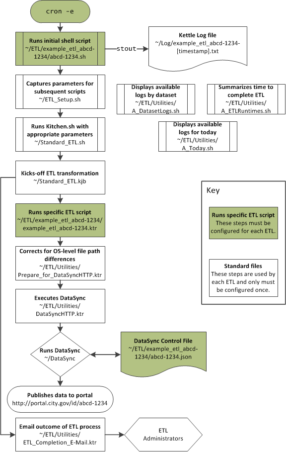

=====================
Setting-up Automation
=====================

This section describes how to setup automation using Kettle. This is currently dependent on a number of bash scripts and is only compatible with MacOS X, Linux, and Unix operating systems.

There are a number of files and transformations used to support the entire ETL. The diagram below shows the workflow and relationship between various files. 

The automated process is initiated using a bash script, ``Setup-Script.sh``, to kick-off scripts. The author also needs to setup the timing of the scripts using cron jobs.

Configurating Setup-Script.sh (e.g., abcd-1234.sh)
--------------------------------------------------

``Setup-Script.sh`` is a standard template to be copied and used with each ETL. Suppose the dataset as a four-by-four of "abcd-1234", then begin by moving the template to the appropriate directory::
	
	$ cd /path/to/directory/open-data-etl-utility-kit
	$ cp Setup-Script.sh Data_Set_Name_abcd-1234/abcd-1234.sh

Each file will need to be edited with the appropriate the name of the KTR file without the extension ``ETL_Name`` and the directory containing the ETL. Using the above example, the file should be edited with the following lines::

	ETL_NAME=ata_Set_Name_abcd-1234
	ETL_DIR_RELATIVE=Data_Set_Name_abcd-1234/

After editing, save the file.

Finally, edit ``open-data-etl-utility-kit/ETL/ETL_Setup.sh`` to include the file path to Java and the ETL directory::

	PATH=$PATH:/path/to/jdk/bin
	ETL_ROOT_DIR=/path/to/directory/open-data-etl-utility-kit/ETL

Setting-up Timing
-----------------

The timing of the automated script is manged through cron jobs. Edit the cron job manager in the terminal by typing ``crontab -e`` in the shell. The cron job contains the starting script and also instructs the logging to be directed to the appropriate log files. For example::
	
	* * * * * /path/to/directory/open-data-etl-utility-kit/ETL/Data_Set_Name_abcd-1234/abcd-1234.sh >> /path/to/directory/ETL/Data_Set_Name_abcd-1234/abcd-1234.log 2>&1

The astrisks should be edited to meet the desired update schedules. A quick guides of those settings can be found on `Wikipedia <http://en.wikipedia.org/wiki/Cron#Predefined_scheduling_definitions>`_.

Testing process
---------------

A simple way to test the process is to execute the following line in the command prompt::
	
	/path/to/directory/open-data-etl-utility-kit/ETL/Data_Set_Name_abcd-1234/abcd-1234.sh >> /path/to/directory/ETL/Data_Set_Name_abcd-1234/abcd-1234.log 2>&1

If correctly configured, the dataset should be updated, log files should be updated, and users should receive email alerts.
