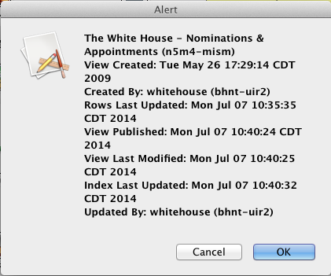

================================
Utilities for Administering ETLs
================================

This repository contains several helpful tools to assist with monitoring ETL processes. 

Checking last-updated information
---------------------------------

**File:** Show_Update_Times_of_View.ktr

**Description:** A Kettle transformation to be run in Spoon (the Kettle GUI).  It pulls update information about a dataset from Socrata APIs and presents it in a human-readable format.

**Usage:** Open Show_Update_Times_of_View.ktr in Kettle/Pentaho. For the initial setup, open the "Inputs" step and replace baseURL parameter with the URL for a specific data portal (e.g., opendata.socrata.com, data.cityofchicago.org). 

.. image:: images/show_update_times_of_view_baseURL_config.png
   :alt: Setting baseURL

To execute, run the transformation (F9) and input the appropriate `4x4 <http://dev.socrata.com/docs/endpoints.html>`_ as a value for the PARAM_four-by-four parameter, then press "OK"

.. image:: images/show_update_times_of_view_4x4_config.png
   :alt: Inputting 4x4

**Returns:** If successful, it will return a prompt window with the following fields:

*	Dataset/view title
*	Creation date and time
*	Dataset/view author
*	Last-updated date and time
*	Published date and time
*	Last modified date and time
*	Index last modified date and time
*	Username who last updated data

Show all log files
-------------------

**File:** Log/A_DatasetLogs.sh (MacOS X/Linux/Unix only)

**Description:** Shows all of the log files associated with a dataset.

**Usage:** Open the terminal and type the name of a dataset::
	
	$ cd /path/to/directory/open-data-etl-utility-kit/
	$ sh Log/A_DatasetLogs.sh Name_of_dataset

**Returns:** Will list the log files associated for a user-specified ETL job. The output is displayed in the terminal.

**File:** Log/A_DatasetLogs.bat (Windows only)
 
**Description:** Shows all of the log files associated with a dataset.
 
**Usage:** Open the command prompt window and type the name of a dataset::
 	
	> cd \path\to\directory\open-data-etl-utility-kit\
	> \Log\A_DatasetLogs.bat Name_of_dataset
 
**Returns:** Will list the log files associated for a user-specified ETL job. The output is displayed in the command prompt window.

Summarize ETL run times
-----------------------

**File:** Log/A_ETLRuntimes.sh (MacOS X/Linux/Unix only)

**Description:** Shows the runtime for ETLs with a dataset.

**Usage:** Open the terminal and type the name of a dataset::

	$ cd /path/to/directory/open-data-etl-utility-kit/
	$ sh Log/A_ETLRuntimes.sh Name_of_dataset

**Returns:** The output will show the total run-times recorded in log files for the user-specified ETL. The output is displayed in the terminal.

**File:** Log/A_ETLRuntimes.bat (Windows only)

**Description:** Shows the runtime for ETLs with a dataset.

**Usage:** Open the command prompt window and type the name of a dataset::

	> cd \path\to\directory\open-data-etl-utility-kit\
	> Log\A_ETLRuntimes.bat Name_of_dataset

**Returns:** The output will show the total run-times recorded in log files for the user-specified ETL. The output is displayed in the command prompt window.

Show today's ETL logs
---------------------

**File:** Log/A_TodayLogs.sh (MacOS X/Linux/Unix only)

**Description:** Shows log files which were created today

**Usage:** Open the terminal and run the command::

	$ sh /path/to/directory/open-data-etl-utility-kit/Log/A_TodayLogs.sh [-e]

**Returns:** The output will show the list of log files which were generated today. With the *-e* parameter, a group of datasets specified in a parameter at the beginning of the script will be excluded (generally, those that run frequently and would clutter the output). The output is displayed in the terminal.

**File:** Log/A_TodayLogs.bat (Windows only)

**Description:** Shows log files which were created today

**Usage:** Open the command prompt window and run the command::

	> sh \path\to\directory\open-data-etl-utility-kit\Log\A_TodayLogs.bat [-e]

**Returns:** The output will show the list of log files which were generated today. With the *-e* parameter, a group of datasets specified in a parameter at the beginning of the script will be excluded (generally, those that run frequently and would clutter the output). The output is displayed in the command prompt window.

Run a specific ETL
---------------------

**File:** Log/A_RunETL.sh (MacOS X/Linux/Unix only)

**Description:** Performs a one-time run of an ETL normally run on a scheduled basis through the crontab file.  This file need not be in the Log directory to run correctly.  It does not use the log files and is in the Log directory only to keep it with other scripts.

**Usage:** Open the terminal and type the name of a dataset::

	$ cd /path/to/directory/open-data-etl-utility-kit/
	$ sh Log/A_RunETL.sh Name_of_dataset

**Returns:** The script will find and run the ETL command for the specified dataset. The output will show the command run so the user can confirm it was the intended dataset ETL.

**File:** Log/A_RunETL.bat (Windows only)

**Description:** Performs a one-time run of an ETL normally run on a scheduled basis through by the Windows task scheduler.  This file need not be in the Log directory to run correctly.  It does not use the log files and is in the Log directory only to keep it with other scripts.

**Usage:** Open the terminal and type the name of a dataset::

	$ cd \path\to\directory\open-data-etl-utility-kit\
	$ Log\A_RunETL.bat Name_of_dataset

**Returns:** The script will find and run the ETL command for the specified dataset. The output will show the command run so the user can confirm it was the intended dataset ETL.
