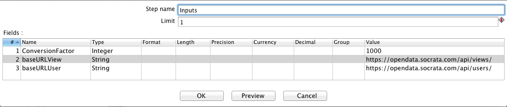
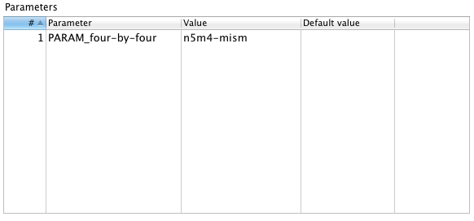

================================
Utilities for Administering ETLs
================================

This repository contains several helpful tools to assist with monitoring ETL processes. 

Checking last-updated information
---------------------------------

**File:** Show_Update_Times_of_View.ktr

**Description:** A Kettle transformation to be run in Spoon (the Kettle GUI).  It pulls update information about a dataset from Socrata APIs and presents it in a human-readable format.

**Usage:** Open Show_Update_Times_of_View.ktr in Kettle/Pentaho. For the initial setup, open the "Inputs" step and replace baseURL parameter with the URL for a specific data portal (e.g., opendata.socrata.com, data.cityofchicago.org). 

To execute, run the transformation (F9) and input the appropriate [4x4](http://dev.socrata.com/docs/endpoints.html) as a value for the PARAM_four-by-four parameter, then press "OK"

**Returns:** If successful, it will return a prompt window with the following fields:

*	Dataset/view title
*	Creation date and time
*	Dataset/view author
*	Last-updated date and time
*	Published date and time
*	Last modified date and time
*	Index last modified date and time
*	Username who last updated data

INSERT SCREENSHOT

Show all log files
-------------------

**File:** Log/A_DatasetLogs.sh (MacOS X/Linux/Unix only)

**Description:** Shows all of the log files associated with a dataset.

**Usage:** Open the terminal and type the name of a dataset:
	
	$ cd /path/to/directory/open-data-etl-utility-kit/
	$ sh Log/A_DatasetLogs.sh Name_of_dataset

**Returns:** Will list the log files associated for a user-specified ETL job. The output is displayed in the terminal.

Summarize ETL run times
-----------------------

**File:** Log/A_DatasetLogs.sh (MacOS X/Linux/Unix only)

**Description:** Shows the runtime for ETLs with a dataset.

**Usage:** Open the terminal and type the name of a dataset:

	$ cd /path/to/directory/open-data-etl-utility-kit/
	$ sh Log/A_ETLRuntimes.sh Name_of_dataset

**Returns:** The output will show the total run-times recorded in log files for the user-specified ETL. The output is displayed in the terminal.

Show today's ETL logs
---------------------

**File:** Log/A_TodayLogs.sh (MacOS X/Linux/Unix only)

**Description:** Shows log files which were created oday

**Usage:** Open the terminal and run the command:

	$ sh /path/to/directory/open-data-etl-utility-kit/Log/A_odayLogs.sh

**Returns:** The output will show the list of log files which were generated today. The output is displayed in the terminal.
